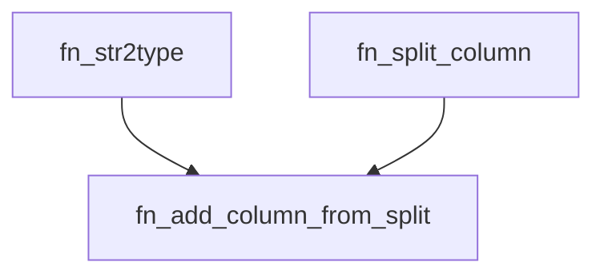

<div align="center">
    |
    <a href="README_ES.md">
        
    </a>
    |
    <a href="fn_add_column_from_split.pqm">
        
    </a>
    |
</div>

<hr>

# fn_split_column

The `fn_add_column_from_split` function adds a new column to an existing table. The new column is created by splitting the values of an existing column at a specified split position. The values of the new column can be converted into different data types.

## Syntax

```m
fn_add_column_from_split(table, new_column_name, column_to_split, position, data_type, delimiter)
```

### Parameters
- **`table` (table)**: The table to which the new column will be added.
- **`new_column_name` (text)**: The name of the new column to be created.
- **`column_to_split` (text)**: The name of the column to be used for splitting the values.
- **`position` (int)**: The position at which the new column will be created.
- **`data_type` (text, optional)**: Data type to which the text value will be converted. Accepted values are:
    - `text` : Text value, this is the default value.
    - `int` : 64-bit signed integer.
    - `float` : 64-bit signed floating-point number.
    - `bool` : Boolean value.
    - `date` : Date value.
- **`delimiter` (text, optional)**: The delimiter character to be used for splitting the data. The default value is "_".

### Returns

- **`table`**: A copy of the original table with the new column added and its corresponding data type.

## Examples

This adds a new column named "campaign_name" to the table with the first value ($0$) from the "full_campaign_name" column.

```m
>>> fn_add_column_from_split(
...     Table.FromRecords({
...         [full_campaign_name = "Campaign_123"],
...         [full_campaign_name = "Campaign_456"]
...     }),
...     "campaign_name",
...     "full_campaign_name",
...     0,
...     "text"
... )
table(
    {"full_campaign_name", "campaign_name"},
    {
        {"Campaign_123", "Campaign"},
        {"Campaign_456", "Campaign"}
    }
)
```

This adds a new column named "campaign_id" to the table with the data type `int`. These values are taken from the second position ($1$) of the "full_campaign_name" column.

```m
>>> fn_add_column_from_split(
...     Table.FromRecords({
...         [full_campaign_name = "Campaign_123"],
...         [full_campaign_name = "Campaign_456"]
...     }),
...     "campaign_id",
...     "full_campaign_name",
...     1,
...     "int"
... )
table(
    {"full_campaign_name", "campaign_id"},
    {
        {"Campaign_123", 123},
        {"Campaign_456", 456}
    }
)
```
## Usage:

#### Embedded Code:

https://github.com/JuanS3/PowerQueryM/assets/24811106/b8eea11c-be34-4f5c-a474-c8ab2f027c2c

1. Paste the function code directly into the Power Query formula bar.
2. Press the `Enter` to execute the function.
3. Rename the Query to the function name, and it will be available for use in other functions and queries.

### Use the function:

- The `fn_split_column` function can be used in conjunction with other Power Query functions to perform more complex tasks. For instance, you can use it to extract specific values from a formatted text string or split a text string into multiple columns.
- The function can also be used in conditional queries. For example, you can use it to return different parts of a text string based on a value in another column.

## Notes:

- If the delimiter is not present in a value, the function will return a null value for that row in the new column.
- If the specified position exceeds the number of parts obtained by splitting a value, the function will return a null value for that row in the new column.
- The function does not modify the original table; instead, it returns a copy with the new column added.
- Type conversion may fail if the split value is not compatible with the specified data type, in which case a null value will be returned for that row in the new column.
- The `fn_add_column_from_split` function is case-sensitive.
- It depends on the `fn_str2type` and `fn_split_column` functions.



## Author
[Sebastian Martinez](https://JuanS3.github.io/)

  - ***GitHub:*** [https://github.com/JuanS3](https://github.com/JuanS3)
  - ***Website:*** [https://JuanS3.github.io/](https://JuanS3.github.io/)
  - ***LinkedIn:*** [https://www.linkedin.com/in/jsebastian-martinez/](https://www.linkedin.com/in/jsebastian-martinez/)
