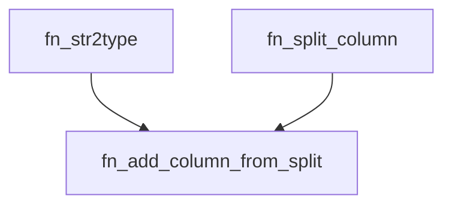

<div align="center">
    |
    <a href="README.md">
        
    </a>
    |
    <a href="fn_split_column.pqm">
        
    </a>
    |
</div>

<hr>

# fn_add_column_from_split

La función `fn_add_column_from_split` agrega una nueva columna a una tabla existente. La nueva columna se crea dividiendo los valores de una columna existente en una posición de división determinada. Los valores de la nueva columna se pueden convertir en diferentes tipos de datos.

## Syntax

```m
fn_add_column_from_split(tabla, nombre_nueva_columna, nombre_columna_a_dividir, tipo_dato, delimitador)
```

### Parameters

- **`tabla` (tabla)**: La tabla a la que se agregará la nueva columna.
- **`nombre_nueva_columna` (texto)**: El nombre de la nueva columna que se creará.
- **`nombre_columna_a_dividir` (texto)**: El nombre de la columna que se utilizará para dividir los valores.
- **`tipo_dato` (texto, opcional)**: Tipo de datos al que se intentará convertir el valor de texto, los valores aceptados son:
    - `text` : Valor de texto, este es el valor por defecto.
    - `int` : Número entero de 64 bits con signo.
    - `float` : Número de punto flotante de 64 bits con signo.
    - `bool` : Valor booleano.
    - `date` : Valor de fecha.
- **`delimitador` (texto, opcional)**: El carácter de delimitación que se utilizará para dividir los datos. El valor predeterminado es "_".

### Returns

- **`tabla`**: Una copia de la tabla original con la nueva columna agregada y su columna de tipo de datos correspondiente.

## Examples

Esto agrega una nueva columna llamada "Campaign_name" a la tabla con el primer valor ($0$) de la columna "full_campaign_name"

```m
>>> fn_add_column_from_split(
...     Table.FromRecords({
...         [full_campaign_name = "Campaign_123"],
...         [full_campaign_name = "Campaign_456"]
...     }),
...     "campaign_name",
...     "full_campaign_name",
...     0,
...     "text"
... )
table(
    {"full_campaign_name", "campaign_name"},
    {
        {"Campaign_123", "Campaign"},
        {"Campaign_456", "Campaign"}
    }
)
```

Esto agrega una nueva columna llamada "campaign_id" a la tabla con el tipo de dato `int`, estos valores se toman de la segunda posición ($1$) de la columna "full_campaign_name"

```m
>>> fn_add_column_from_split(
...     Table.FromRecords({
...         [full_campaign_name = "Campaign_123"],
...         [full_campaign_name = "Campaign_456"]
...     }),
...     "campaign_id",
...     "full_campaign_name",
...     1,
...     "int"
... )
table(
    {"full_campaign_name", "campaign_id"},
    {
        {"Campaign_123", 123},
        {"Campaign_456", 456}
    }
)
```


## Uso:

### 1. Cargar la función:

#### Código integrado:

https://github.com/JuanS3/PowerQueryM/assets/24811106/b8eea11c-be34-4f5c-a474-c8ab2f027c2c

1. Pegue el código de la función directamente en la barra de fórmulas de Power Query.
2. Presione `Enter` para ejecutar la función.
3. Renombrar el query por el nombre la función y esta estará disponible para su uso en otras funciones y consultas.

### Uso de la función:

- La función `fn_add_column_from_split` se puede utilizar junto con otras funciones de Power Query para realizar tareas más complejas. Por ejemplo, puede usarla para extraer valores específicos de una cadena de texto formateada o dividir una cadena de texto en varias columnas.
- La función también se puede utilizar en consultas condicionales. Por ejemplo, puede usarla para devolver diferentes partes de una cadena de texto en función de un valor en otra columna.

## Notas:

- Si el delimitador no está presente en un valor, la función regresará un valor nulo para esa fila en la nueva columna.
- Si la posición especificada excede el número de partes obtenidas al dividir un valor, la función regresará un valor nulo para esa fila en la nueva columna.
- La función no modifica la tabla original; en su lugar, devuelve una copia con la nueva columna añadida.
- La conversión de tipos puede fallar si el valor dividido no es compatible con el tipo de datos especificado, en cuyo caso, se regresará un valor nulo para esa fila en la nueva columna.
- La función `fn_add_column_from_split` distingue entre mayúsculas y minúsculas.
- Tiene dependecia con la función `fn_str2type` y `fn_split_column`.



## Autor
[Sebastian Martinez](https://JuanS3.github.io/)

  - ***GitHub:*** [https://github.com/JuanS3](https://github.com/JuanS3)
  - ***Sitio web:*** [https://JuanS3.github.io/](https://JuanS3.github.io/)
  - ***LinkedIn:*** [https://www.linkedin.com/in/jsebastian-martinez/](https://www.linkedin.com/in/jsebastian-martinez/)

