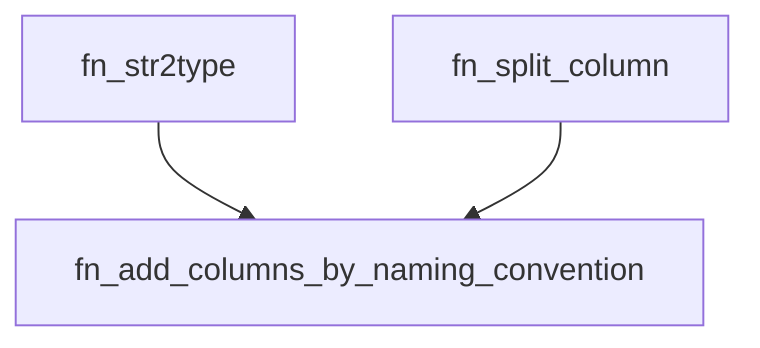

<div align="center">
    |
    <a href="README_ES.md">
        
    </a>
    |
    <a href="fn_add_columns_by_naming_convention.pqm">
        
    </a>
    |
</div>
<hr>

# fn_add_columns_by_naming_convention

`fn_add_columns_by_naming_convention` is a function that takes a table, a column name to split, a list of column specifications, and optionally a delimiter character. It returns the table with the new columns added, where each new column name is a combination of the original column name and the table name, separated by the delimiter.

```m
fn_add_columns_by_naming_convention(table_name, col_2_split, columns, start_split, end_split, [delimiter])
```


### Parameters

- **`tbl` (table)**: The table to which the new columns will be added.
- **`col_2_split` (text)**: The name of the column to be split.
- **`columns` (list)**: A list of column specifications, where each specification is a list with two elements:
  - The name of the new column to be created.
  - The type of column to add (text for text values or int for integer values).
- **`start_split` (number)**: Initial number of the column in the list of columns to add.
- **`end_split` (number)**: Final number of the column in the list of columns to add.
- **`delimiter` (text, optional)**: Delimiter between the table name and the column name. The default value is "_".

### Returns

- **`table`**: The table with the new columns added.

### Examples
```m
let
    Source = Table.FromRecords({
        [full_name="sebastian_martinez"],
        [full_name="the_one_code_is_real"]
    }),
    ColumnsToAdd = {{"first_name", "text"}, {"last_name", "text"}},
    AddedColumns = fn_add_columns_naming_convention(Source, "full_name", ColumnsToAdd, 0, 2, "_")
in
    AddedColumns
// Returns a table with columns "first_name" and "last_name" added, with values extracted from "full_name"
```

## Usage:

#### Embedded Code:

https://github.com/JuanS3/PowerQueryM/assets/24811106/b8eea11c-be34-4f5c-a474-c8ab2f027c2c

1. Paste the function code directly into the Power Query formula bar.
2. Press `Enter` to execute the function.
3. Rename the Query to the function name, and it will be available for use in other functions and queries.

### Use the function:

- The `fn_add_columns_by_naming_convention` function can be used in conjunction with other Power Query functions to perform more complex tasks. For instance, you can use it to add multiple columns to a table based on the values of an existing column.
- The function can also be used in conditional queries. For example, you can use it to dynamically add columns to a table based on certain conditions.

## Notes:

- The `fn_add_columns_by_naming_convention` function is case-sensitive.
- If the delimiter character is null or an empty string, the function will default to using the underscore (_) character.
- Ensure that the columns list provided has valid specifications for the columns to be added.
- It depends on the `fn_str2type` and `fn_split_column` functions.




## Author
[Sebastian Martinez](https://JuanS3.github.io/)

  - ***GitHub:*** [https://github.com/JuanS3](https://github.com/JuanS3)
  - ***Website:*** [https://JuanS3.github.io/](https://JuanS3.github.io/)
  - ***LinkedIn:*** [https://www.linkedin.com/in/jsebastian-martinez/](https://www.linkedin.com/in/jsebastian-martinez/)

