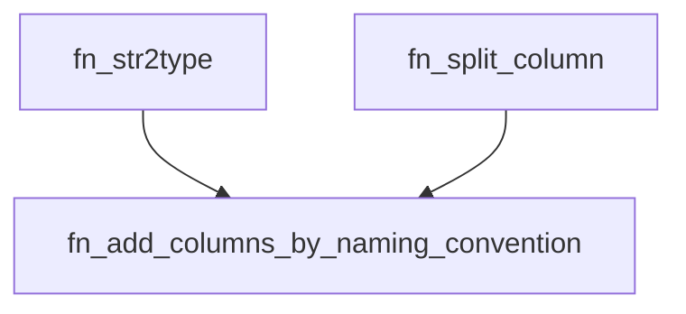

<div align="center">
    |
    <a href="README_EN.md">
        
    </a>
    |
    <a href="fn_add_columns_by_naming_convention.pqm">
        
    </a>
    |
</div>
<hr>

# fn_add_columns_by_naming_convention

`fn_add_columns_by_naming_convention` es una función que recibe una tabla, un nombre de columna para dividir, una lista de especificaciones de columnas y, opcionalmente, un carácter delimitador. Devuelve la tabla con las nuevas columnas añadidas, donde cada nuevo nombre de columna es una combinación del nombre de la columna original y el nombre de la tabla, separados por el delimitador.

## Sintaxis
```m
fn_add_columns_by_naming_convention(tbl, col_2_split, columns, start_split, end_split, [delimiter])
```

### Parámetros

- **`table_name` (tabla)**: La tabla a la que se le añadirán las nuevas columnas.
- **`col_2_split` (texto)**: El nombre de la columna que se va a dividir.
- **`columns` (lista)**: Una lista de especificaciones de columnas, donde cada especificación es una lista con dos elementos:
  1. El nombre de la nueva columna que se creará.
  2. El tipo de columna a agregar (`text` para valores de texto o `int` para valores enteros).
- **`start_split` (número)**: Número inicial de la columna en la lista de columnas a añadir.
- **`end_split` (número)**: Número final de la columna en la lista de columnas a añadir.
- **`delimiter` (texto, opcional)**: Delimitador entre el nombre de la tabla y el nombre de la columna. El valor predeterminado es "_".

### Retorna

- **`table`**: La tabla con las nuevas columnas añadidas.

## Ejemplos
```m
let
    Source = Table.FromRecords({
        [full_name="sebastian_martinez"],
        [full_name="the_one_code_is_real"]
    }),
    ColumnsToAdd = {{"first_name", "text"}, {"last_name", "text"}},
    AddedColumns = fn_add_columns_naming_convention(Source, "full_name", ColumnsToAdd, 0, 2, "_")
in
    AddedColumns
// Devuelve una tabla con las columnas "first_name" y "last_name" añadidas, con valores extraídos de "full_name"
```

## Uso:

### 1. Cargar la función:

#### Código integrado:

https://github.com/JuanS3/PowerQueryM/assets/24811106/b8eea11c-be34-4f5c-a474-c8ab2f027c2c

1. Pegue el código de la función directamente en la barra de fórmulas de Power Query.
2. Presione `Enter` para ejecutar la función.
3. Renombrar el query por el nombre la función y esta estará disponible para su uso en otras funciones y consultas.

### Uso de la función:

- La función `fn_add_columns_by_naming_convention` se puede utilizar junto con otras funciones de Power Query para realizar tareas más complejas. Por ejemplo, puede usarla para extraer valores específicos de una cadena de texto formateada o dividir una cadena de texto en varias columnas.
- La función también se puede utilizar en consultas condicionales. Por ejemplo, puede usarla para devolver diferentes partes de una cadena de texto en función de un valor en otra columna.

## Notas:

- La función `fn_add_columns_by_naming_convention` distingue entre mayúsculas y minúsculas.
- Si el carácter delimitador es nulo o una cadena vacía, la función dividirá la cadena de texto en tokens basados en espacios en blanco.
- Si la posición está fuera de rango, la función devolverá un valor nulo.
- Tiene dependecia con la función `fn_str2type` y `fn_split_column`.




## Autor
[Sebastian Martinez](https://JuanS3.github.io/)

  - ***GitHub:*** [https://github.com/JuanS3](https://github.com/JuanS3)
  - ***Sitio web:*** [https://JuanS3.github.io/](https://JuanS3.github.io/)
  - ***LinkedIn:*** [https://www.linkedin.com/in/jsebastian-martinez/](https://www.linkedin.com/in/jsebastian-martinez/)

